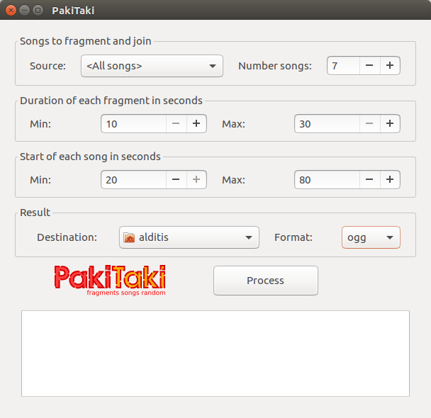

A Rhythmbox plugin to generate one song of songs fragments randomly.
Some details:
- Only songs in formats ogg and mp3 actualy.
- Song generate in 128kb.
- Effect between songs is type `tri`.

### Requeriments
````bash
sudo apt get install python-pip: pip install ffmpy
sudo apt get install python-gobject python-gobject-2 glib-compile-schemas
````

### Installation
````bash
git clone https://github.com/alditis/pakitaki
cp -R pakitaki ~/.local/share/rhythmbox/plugins
sudo cp schema/org.gnome.rhythmbox.plugins.pakitaki.gschema.xml /usr/share/glib-2.0/schemas/
sudo glib-compile-schemas /usr/share/glib-2.0/schemas/
````

### Usage
- In the Rhythmbox menu click Plugins, select the plugin for active.
- In the Rhythmbox menu click View, select PakiTaki for show window dialog.



### TODO
- Support for others formats.
- Select bitrate of output song.

### People
Author: [alditis](https://github.com/alditis)

If this plugin help you some and you want support me, you can give me a donate. Thanks!

[](https://liberapay.com/alditis/donate)
&nbsp;&nbsp;&nbsp;
[](https://www.paypal.me/alditis)
&nbsp;&nbsp;&nbsp;
[](https://blockchain.info/address/1C1tt4zXSRtjGs8p4hcmAoqY6BFDRYeuBG)

### License

[MIT](LICENSE)